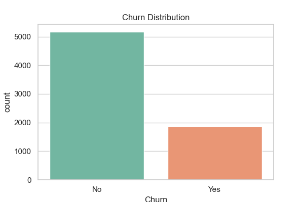
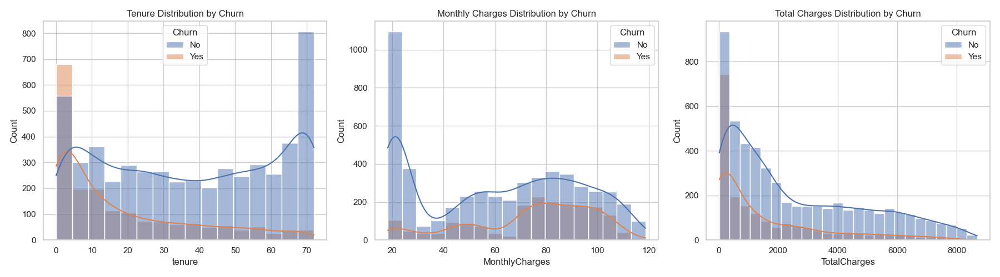
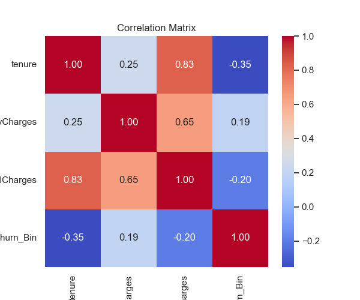

# Customer Churn Prediction Pipeline

This repository contains an end-to-end Machine Learning pipeline designed to predict customer churn in the telecommunications industry using the IBM Telco Customer Churn dataset.

## Project Overview

The objective is to accurately predict whether a customer will churn (cancel their service) and proactively identify at-risk customers. The project encompasses Exploratory Data Analysis (EDA), extensive Feature Engineering, Model Training with hyperparameter tuning, Class Imbalance handling via SMOTEENN, and deployment through a Flask REST API.

## Dataset Description

The **Telco Customer Churn** dataset contains ~7,000 rows with 21 columns including customer demographics, account details, services signed up for (like internet, streaming, tech support), and the target variable `Churn` (Yes/No).

## Methodology

1. **Exploratory Data Analysis (EDA)**: Addressed missing values in numeric columns (`TotalCharges`) and visualized feature correlations and churn distribution.
2. **Feature Engineering**: 
   - Engineered `tenure_bin` (0-12, 13-24, 25-48, 49-60, 60+ months).
   - Created robust service flags (`has_multiple_services`, `has_streaming`, `has_internet_addons`).
   - Categorical variables were one-hot encoded.
3. **Class Imbalance**: Used `SMOTEENN` (Synthetic Minority Over-sampling Technique combined with Edited Nearest Neighbors) to balance the target class.
4. **Model Tuning & Training**: 
   - Decision Tree, Random Forest, and XGBoost were tuned using GridSearchCV/RandomizedSearchCV.
   - Evaluated models prioritizing a balance between ROC-AUC and Recall.

## Setup & Run Instructions

### Prerequisites
- Python 3.9+
- `pip`

### Installation
1. Clone the repository:
```bash
git clone https://github.com/yashijha12/Customer-Churn-Prediction-Pipeline.git
cd Customer-Churn-Prediction-Pipeline
```
2. Create and activate a virtual environment:
```bash
python -m venv venv
source venv/bin/activate
```
3. Install dependencies:
```bash
pip install -r requirements.txt
```

### Executing the Pipeline
1. Run EDA and generate plots (saved in `data/`):
```bash
python src/eda.py
```
2. Run data downloading (if needed) and model training:
```bash
python src/download_data.py
python src/train_models.py
```
3. Evaluate the saved best model:
```bash
python src/evaluate.py
```

### Running the Web App
1. Start the Flask application:
```bash
python app.py
```
2. Open `http://localhost:5000/` in your browser to interact with the churn prediction form.

## Results & Metrics

Below are the final test set metrics achieved by each model type during tuning:

| Model | ROC-AUC | Recall | Precision | F1 Score |
|---|---|---|---|---|
| **Decision Tree** | 0.7534 | 0.8155 | 0.4485 | 0.5787 |
| **Random Forest** | **0.8247** | **0.7754** | **0.5151** | **0.6190** |
| **XGBoost** | 0.8164 | 0.8155 | 0.4505 | 0.5804 |

**Best Model**: **Random Forest** was selected as the best overall model, achieving an ROC-AUC of ~0.825 and a Recall of ~0.775, closely tracking our target metric objectives.

### Feature Engineering Impact (Ablation Study)

To prove the efficacy of our engineered features (tenure bins + service flags), we conducted a brief ablation study using the Random Forest classifier:

- **Recall without engineered features (Basic Encoding)**: `0.7380`
- **Recall with engineered features**: `0.7754`
- **Relative Improvement**: `~5%`

The inclusion of these intuitive, grouped features allows the trees to find better splitting nodes and improves the recall rate, which is critical for identifying churn correctly.

## Screenshots & Visualizations




